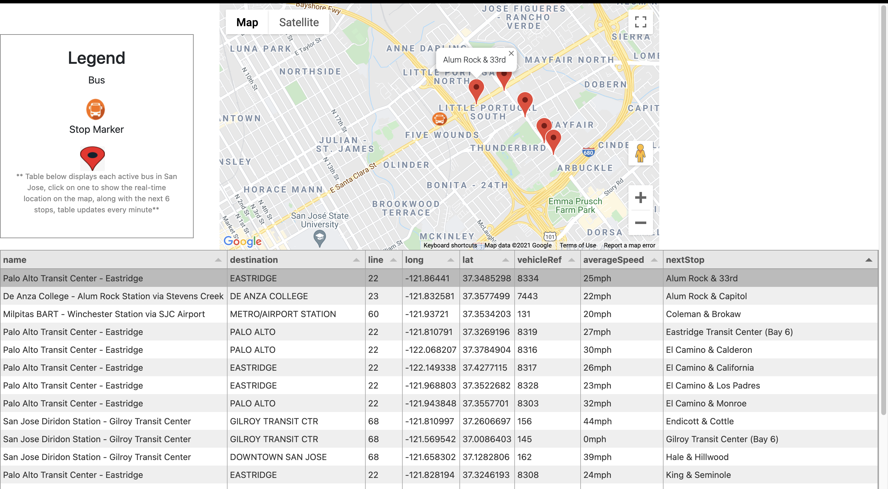

# LookingBus Technical Challenge

## Setup

1) Clone project and run npm install.
2) Run npm start.
3) Navigate to dist/index.html, go to line 30 (google maps script tag), replace YOUR_API_KEY_HERE with your google maps api key, no spaces before or after key.
4) Navigate to src/js/scripts.js, go to line 7, replace YOUR_API_KEY_HERE with your 511.org api key, no spaces before or after key.
5) Refesh page.

